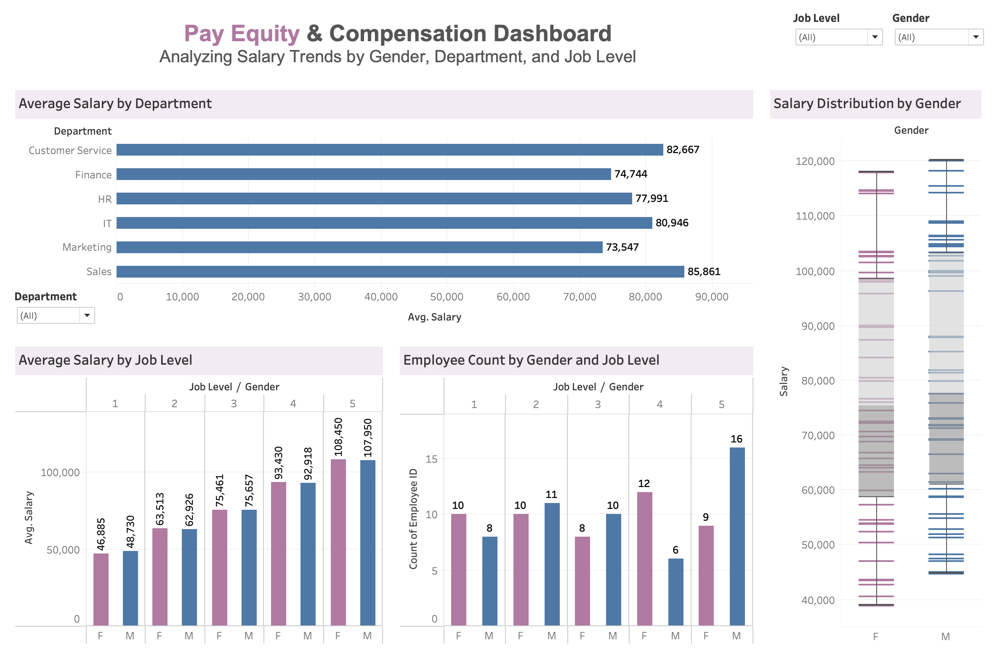

# 📊 Pay Equity & Compensation Analysis  
**Tools Used:** Tableau · Python · SQL

This project explores gender-based pay equity and compensation trends across departments and job levels using a mock HR dataset. I developed three independent solutions using Tableau, Python, and SQL to analyze salary distribution, representation, and potential pay gaps.

---

## 🚀 Project Overview
The analysis identifies:
- How average salary varies by gender and job level
- Where salary gaps may exist
- Gender representation across job levels
- Distribution patterns and outliers

The multi-tool approach demonstrates versatility in handling HR analytics with different technologies.

---

## 🔗 Explore Each Version

### 📊 Tableau Dashboard  
Interactive visuals: average salary by department, box plots by gender, and job level breakdowns.  
🔗 [View Tableau Repository](https://github.com/Obu541/Pay-Equity-Dashboard)

---

### 🐍 Python Analysis (Jupyter Notebook)  
Custom visualizations using pandas, matplotlib, and seaborn with clear insight annotations.  
🔗 [View Python Repository](https://github.com/Obu541/Pay-Equity-Analysis-Python)

---

### 🐬 SQL Analysis (MySQL Workbench)  
Structured queries uncover salary averages, representation counts, and calculated pay gap percentages.  
🔗 [View SQL Repository](https://github.com/Obu541/Pay-Equity-Analysis-SQL)

---

## 💡 Key Insights
- Males tend to earn more than females at several job levels
- Gender representation is uneven in senior positions
- Level-based pay gaps can exceed 10% in certain scenarios

Each version of this project answers the same HR questions with a unique technical perspective.

---

## 🗂 File Overview (in each repo)
- **Tableau:** `dashboard screenshot and link to interactive dashboard  
- **Python:** `.ipynb` notebook + `.csv` + `.png` charts  
- **SQL:** `.sql` script + exported `.csv` results

---

📁  *Created by Olga Buriakova*  
💼 [LinkedIn](https://www.linkedin.com/in/olga-buriakova-a13163128/) | 🌐 [Portfolio](https://obu541.github.io/Portfolio/)
